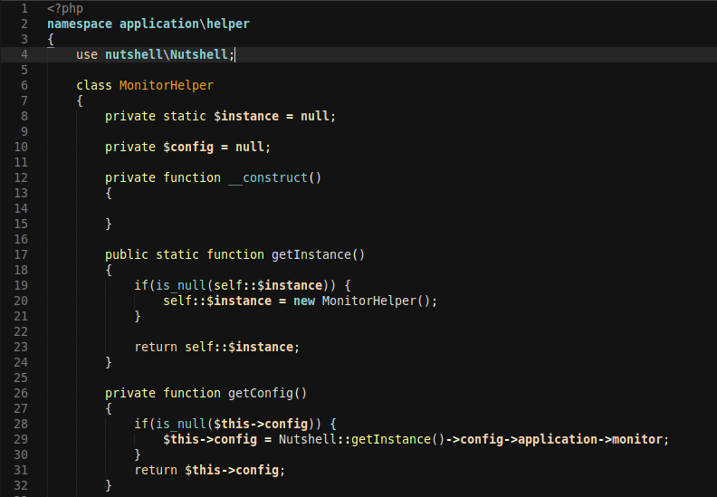

This is a Zenburn inspired Colour Scheme for the Sublime Text 2 editor.
Sublime Text 2 version made by Simon Ilett (https://github.com/APlusDesign).

The package contains two colour schemes: the original Zenburn and a personal version Zenburn-Kuma with a darker editor background colour.

Low contrast, perfect for low lighting conditions.

Screenshots (Zenburn-Kuma variant):

